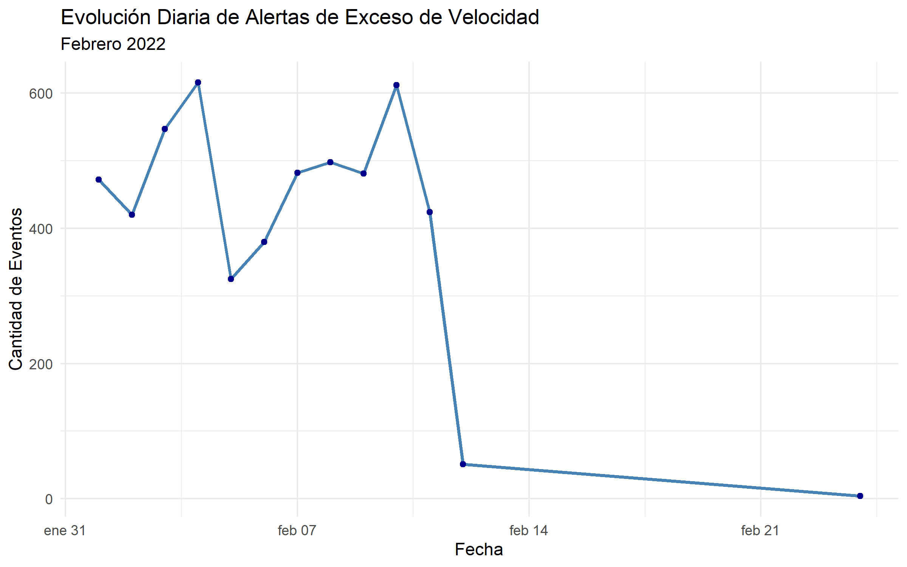
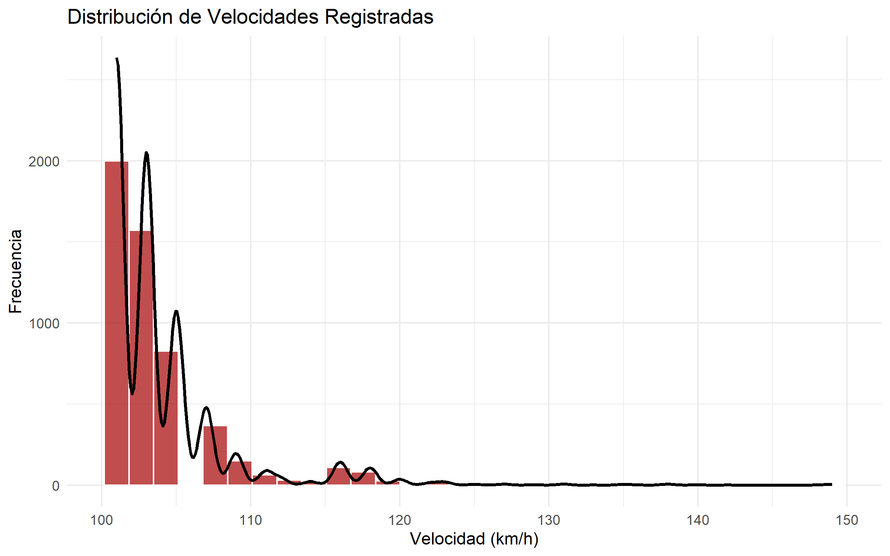
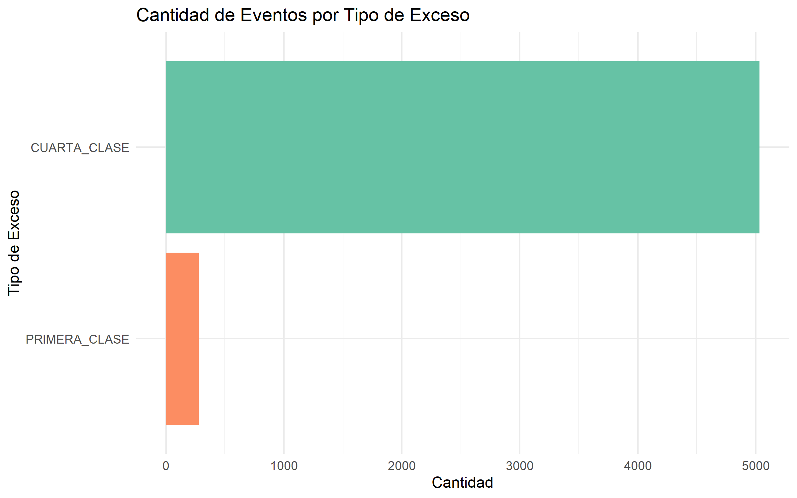
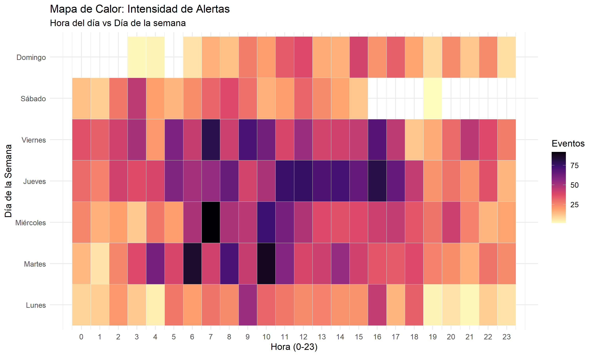

```{r setup, include=FALSE}
knitr::opts_chunk$set(echo = FALSE, message = FALSE, warning = FALSE)
library(readr)
library(knitr)
library(dplyr)
```

# 1. Dataset y Limpieza de Datos

## Descripción Técnica del Dataset
El análisis se basa en el archivo `ant-exceso-velocidad-febrero-2022.csv`. Para garantizar la validez de la simulación, se aplicó un proceso de limpieza riguroso (Script `01_load_clean.R`):

1.  **Filtrado Temporal:** Se restringieron los datos estrictamente a **Febrero 2022** para asegurar un cálculo consistente de las tasas de llegada diarias.
2.  **Eliminación de Outliers:** Se descartaron registros con velocidades > 200 km/h (errores de GPS) y <= 0 km/h.
3.  **Variables Derivadas:** Se generaron atributos como `franja_horaria` (Madrugada, Mañana, Tarde, Noche) para simplificar la configuración de los "Sources" en la simulación.

## Evolución del Dataset
Comparativa entre la estructura original y el resultado final procesado:

**Dataset Original (Raw):**
El archivo `ant-exceso-velocidad-febrero-2022.csv` contenía inicialmente las siguientes 13 variables:

*   `PROVINCIA_OPERADORA`
*   `CIUDAD_OPERADORA`
*   `COD_OPERADORA`
*   `TIPO_OPERADORA`
*   `LATITUD`
*   `LONGITUD`
*   `DIRECCION`
*   `CANTON_EXCESO`
*   `PROVINCIA_EXCESO`
*   `FECHA_ALERTA`
*   `HORA_ALERTA`
*   `VELOCIDAD`
*   `TIPO_EXCESO`

**Problemas Identificados:**
*   Fechas como texto.
*   Coordenadas y decimales con comas.
*   **Valores Sucios:** Registros vacíos (`NA`), velocidades negativas o inverosímiles por errores de sensor.

**Cambios Realizados:**

*   **➕ Nuevas Variables (Feature Engineering):**
    *   `franja_horaria`: Categoría (Mañana, Tarde, Noche) para configurar el Schedule.
    *   `dia_semana`: Día (Lunes-Domingo) para detectar patrones semanales.
    *   `dia_num`: Entero (1-7) usado para ordenar correctamente los gráficos.

*   **➖ Limpieza de Datos (Filas Eliminadas):**
    *   Registros con fecha fuera de Febrero 2022.
    *   Errores extremos de GPS (Velocidad > 200 km/h).
    *   Filas corruptas (Sin velocidad o fecha).

## Diccionario de Varibales Generado
A continuación se detallan las variables disponibles en el dataset procesado `dataset_limpio.csv`:

```{r diccionario}
# Intenta leer desde el directorio padre si se renderiza desde reports/
path_dict <- "../diccionario.csv"
if(!file.exists(path_dict)) path_dict <- "diccionario.csv"

if(file.exists(path_dict)) {
  diccionario <- read_csv(path_dict, show_col_types = FALSE)
  kable(diccionario, caption = "Estructura del Dataset Limpio")
} else {
  cat("Diccionario no encontrado.")
}
```

# 2. Análisis Exploratorio y Visualizaciones

Se presentan las visualizaciones generadas por el script `02_visualizations.R`, con su respectiva interpretación para el modelado en software de simulación.


## A. Demanda en el Tiempo


## A. Demanda en el Tiempo

<div class="viz-container">

<div class="viz-image">
```{r, echo=FALSE, out.width="100%"}

```
</div>

<div class="viz-text">

## Evolución Diaria
Este gráfico nos muestra cuántas infracciones ocurren cada día del mes.

**¿Qué observamos?**
Podemos ver claramente qué días hay más actividad y si existen momentos de "calma" durante el mes, como fines de semana o feriados.

</div>
</div>

## B. Distribución de Velocidad

<div class="viz-container">

<div class="viz-image">
```{r, echo=FALSE, out.width="100%"}

```
</div>

<div class="viz-text">

## Velocidades Frecuentes
Aquí vemos qué tan rápido van los vehículos infractores.

**¿Qué observamos?**
La "montaña" nos indica la velocidad más común. Nos ayuda a entender qué tan grave es el problema: ¿Se exceden por poco o van extremadamente rápido?

</div>
</div>

## C. Tipos de Exceso

<div class="viz-container">

<div class="viz-image">
```{r, echo=FALSE, out.width="100%"}

```
</div>

<div class="viz-text">

## Categorías Principales
Un ranking de los tipos de infracción cometidos.

**¿Qué significan las Clases?**
*   **Clase IV (Moderada):** Es un exceso leve (dentro del rango técnico). Es la más frecuente.
*   **Clase I (Grave):** Es un exceso de velocidad muy alto (fuera del rango moderado). Es la más peligrosa.

**¿Qué observamos?**
Vemos cuál es la infracción que más se repite. Generalmente, una sola categoría domina el gráfico (casi siempre Clase IV), lo que nos dice dónde enfocar el control.

</div>
</div>

## D. Mapa de Calor

<div class="viz-container">

<div class="viz-image">
```{r, echo=FALSE, out.width="100%"}

```
</div>

<div class="viz-text">

## Puntos Calientes
Combina hora y día para encontrar los momentos críticos.

**¿Qué observamos?**
Los cuadros brillantes indican las "Horas Pico". Sabemos exactamente qué día y a qué hora hay más riesgo de accidente.

</div>
</div>


# 3. Parámetros para la Simulación

A continuación presentamos los "Números Mágicos" que configurarán el software de simulación.

**Glosario Rápido:**
*   **Lambda (Tasa de Llegada):** Nos dice el ritmo de los eventos. (Ej. "Llegan 5 buses por hora").
*   **Mean (Media):** El valor promedio de velocidad.
*   **Sd (Desviación Estándar):** Mide la variedad. 
    *   *Nota:* Si este número es alto, significa que el comportamiento es muy caótico (unos muy lentos, otros muy rápidos).
*   **Prob (Probabilidad):** Es el porcentaje de chance de que ocurra un evento específico (ej. "Hay un 90% de probabilidad de que sea Clase IV").

```{r parametros}
path_params <- "../params/params.csv"
if(!file.exists(path_params)) path_params <- "params/params.csv"

if(file.exists(path_params)) {
  params <- read_csv(path_params, show_col_types = FALSE)
  kable(params, caption = "Tabla Maestra de Configuración")
} else {
  cat("Archivo de parámetros no encontrado.")
}
```

# 4. Conclusión

**Conclusión del Análisis de Datos (Febrero 2022)**

El análisis del dataset de la ANT revela que el comportamiento del exceso de velocidad en el transporte público no es aleatorio, sino que sigue **patrones definidos**:

1.  **Predominio de Infracciones Leves:** La inmensa mayoría de las alertas son de **Clase IV (Moderadas)**. Esto indica que los conductores suelen exceder el límite por márgenes pequeños, probablemente por distracción o intentos de rebasar, más que por una conducción temeraria extrema sistemática (Clase I).
2.  **Actividad Diurna:** El mapa de calor confirma que la siniestralidad se concentra en horas laborales del día (Mañana y Tarde), cayendo drásticamente en la madrugada. Esto valida que la simulación debe usar una **tasa de llegada variable** y no constante las 24 horas.
3.  **Estabilidad Semanal:** La serie temporal muestra un flujo relativamente constante sin picos extremadamente inusuales, lo que sugiere que una semana típica de simulación es representativa para proyectar el comportamiento mensual.
4.  **Datos Listos para Simular:** Al haber eliminado los errores de GPS (>200km/h), los parámetros calculados (Lambda, Media, Desviación) son ahora **confiables** para configurar un modelo de eventos discretos que replicará fielmente la realidad operativa.

**En resumen:** Tenemos un sistema con alta frecuencia de infracciones leves, fuertemente ligado a los horarios operativos del día.
